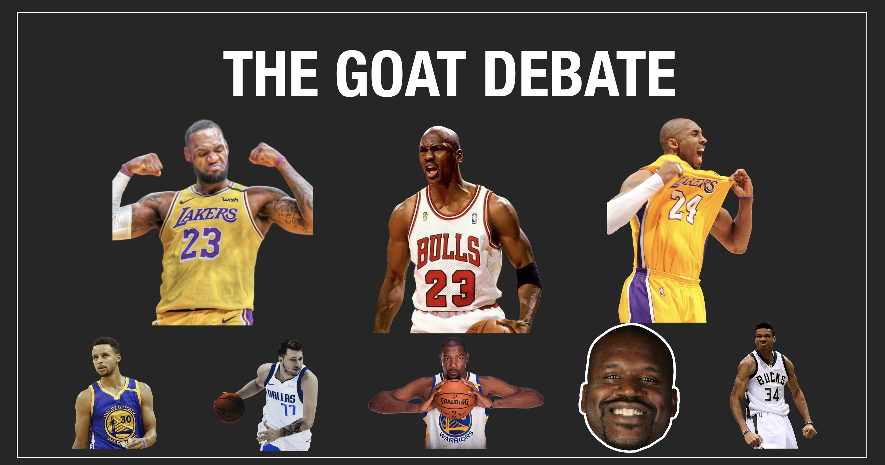
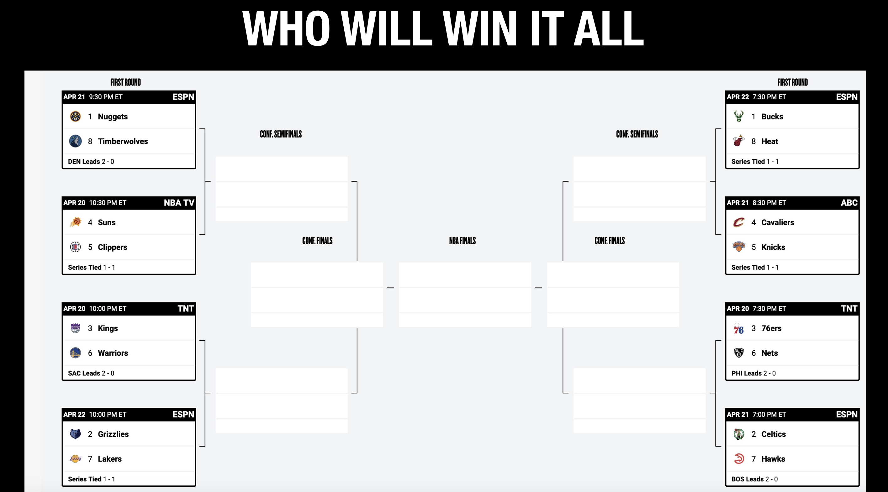

# Information Visualization -  Final Project
## Project Title - NBA - The GOAT Debate and Who will win 2023 Finals

***Project Title: Information Visualization of NBA Player and Team Performance Metrics for Enhanced Insights***

## Project Description:

> The objective of our information visualization project is to leverage data visualization techniques to extract meaningful insights from complex individual player and team statistics within the National Basketball Association (NBA). Our aim is to address two primary problem statements:

 
1. **The GOAT (Greatest of All Time) Debate:** Basketball enthusiasts often engage in discussions about who the greatest player of all time is, with popular opinions ranging from LeBron James, Michael Jordan, to Kobe Bryant. Our goal is to approach this debate from a data-driven perspective, utilizing a combination of both basic and advanced statistical metrics.

 
>Basic statistics to be analyzed include *points per game*, *total rebounds per game*, and *assists per game*. Advanced statistics will be carefully selected to provide a more comprehensive understanding of each player's impact on the game. Potential advanced metrics to consider may include *Player Efficiency Rating (PER)*, *Win Shares (WS)*, *Box Plus/Minus (BPM)*, and *Value Over Replacement Player (VORP)*. By visualizing this data, we aim to facilitate an informed evaluation of the GOAT debate, potentially identifying a clear winner based on statistical evidence.
 
2. **Predicting the 2023 NBA Champions:** Our second objective is to evaluate regular season team and player statistics to discern patterns and metrics that could indicate the potential 2023 NBA champions. By analyzing various performance metrics, we seek to identify a team that is outperforming its competitors and is well-positioned to claim the championship title.

 
>To achieve these objectives, we will employ various data visualization techniques, ensuring that the visualizations are both informative and engaging for the target audience. By effectively conveying complex statistical information, we hope to provide a new perspective on these popular basketball debates, empowering enthusiasts with data-driven insights to support their arguments.
 

## Team Members:

| Full Name | Email ID |
| --- | --- |
| Rishi Vamshi Athinarap | rathinar@uncc.edu |
| Anudeep Billa | abilla@uncc.edu |
| Sai Venkat Kumar Rapol | srapol@uncc.edu |
| Sai Teja Avadhootha | savadhoo@uncc.edu |

